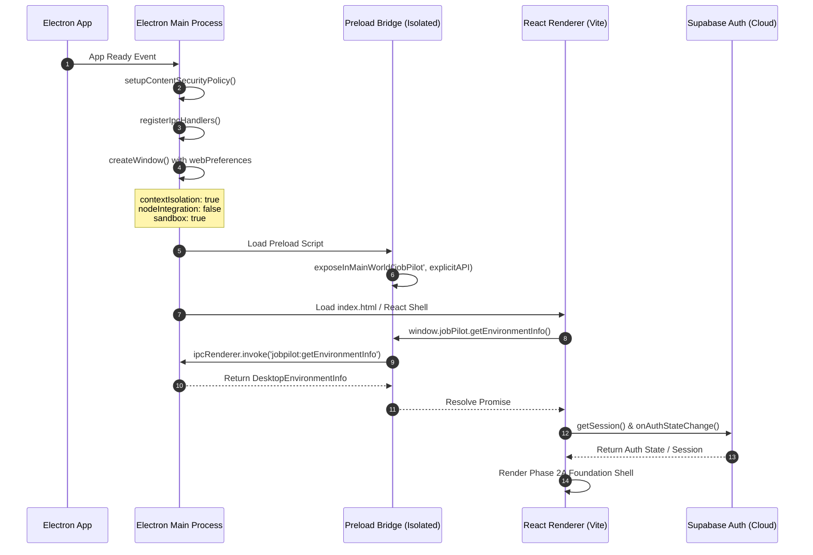

# JobPilot Execution & System Flows

This document details the startup sequences, communication boundaries, and authentication flows established in **Phase 2A**.

---

## 1. Desktop Application Startup Flow



---

## 2. Electron Security Boundary Flow

```text
┌────────────────────────────────────────────────────────┐
│               Privileged Node.js Realm                 │
│  - Electron Main Process (apps/desktop/electron)       │
│  - Access to Node OS, Window Management, App Lifecycle │
└─────────────────────────┬──────────────────────────────┘
                          │ (Isolated IPC Channel)
┌─────────────────────────▼──────────────────────────────┐
│             Preload Boundary (contextBridge)           │
│  - apps/desktop/preload                                │
│  - Exposes ONLY: window.jobPilot.getAppVersion()       │
│                  window.jobPilot.getEnvironmentInfo()  │
│  - Hides: ipcRenderer, fs, child_process, process      │
└─────────────────────────┬──────────────────────────────┘
                          │ (Safe Context)
┌─────────────────────────▼──────────────────────────────┐
│              Unprivileged Web Realm                    │
│  - React Renderer (apps/desktop/renderer)              │
│  - Restricted CSP                                      │
│  - Zero Node API access                                │
│  - Interacts with Supabase Auth (Public Anon Key)      │
└────────────────────────────────────────────────────────┘
```

---

## 3. Node.js API Service Flow

```text
Incoming Request: GET /health
       │
       ▼
[Express Server] (services/api)
       │
       ├─► [healthRouter]
       │       │
       │       └─► Returns HTTP 200 JSON:
       │           {
       │             "status": "ok",
       │             "service": "jobpilot-api",
       │             "timestamp": "2026-08-20T...",
       │             "uptime": 12.34
       │           }
       │
       └─► [404 Catch-All & errorHandler Middleware]
```

---

## 4. Supabase Authentication Flow

1. **Initialization**:
   - React loads `@jobpilot/database`.
   - `getSupabaseBrowserClient()` validates `VITE_SUPABASE_URL` and `VITE_SUPABASE_ANON_KEY` via `@jobpilot/validation`.
   - Single cached client instance is established.

2. **Sign In / Sign Up**:
   - User inputs credentials in `AuthCard`.
   - Client calls `supabase.auth.signInWithPassword()` or `supabase.auth.signUp()`.
   - Supabase responds over HTTPS; session and JWT are persisted client-side.
   - `onAuthStateChange` observer updates React UI state reactively.

3. **Sign Out**:
   - User clicks `Sign Out`.
   - Client calls `supabase.auth.signOut()`.
   - React UI clears cached user state and returns to login view.
