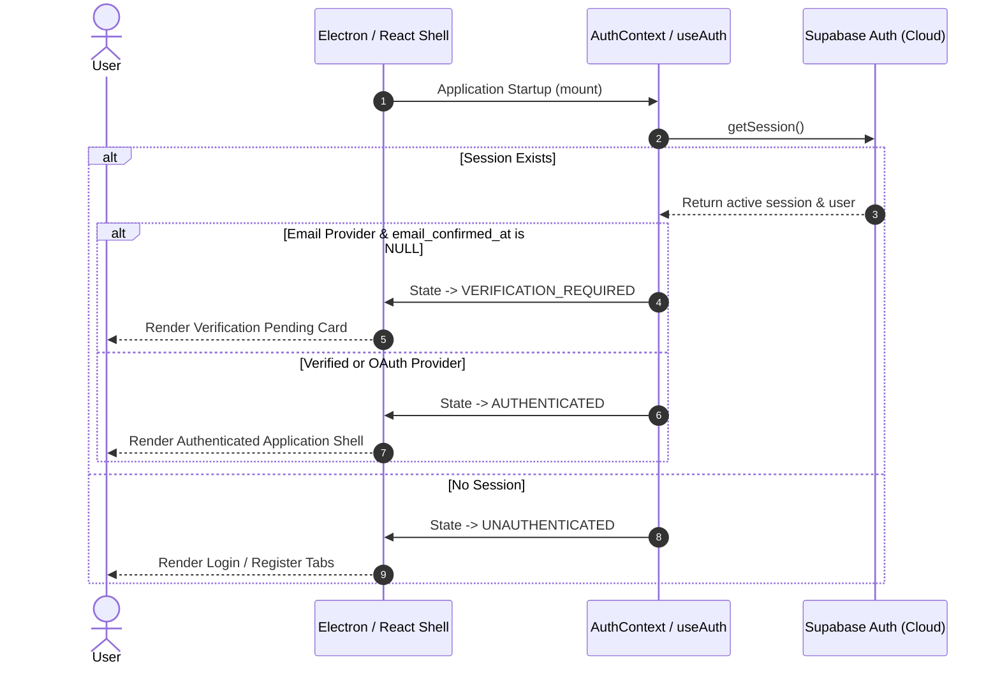
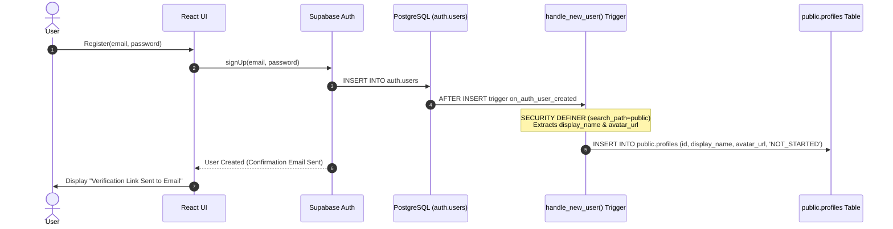
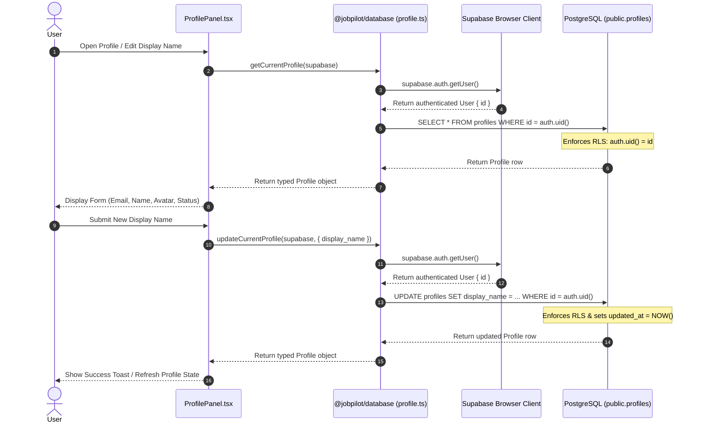
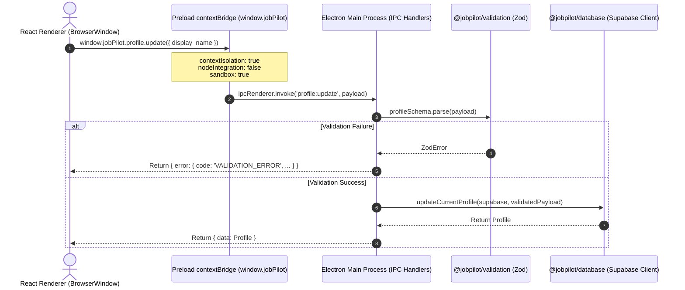
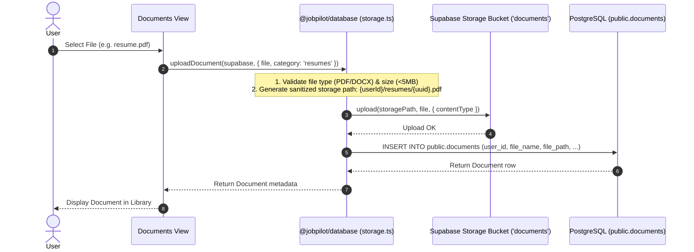
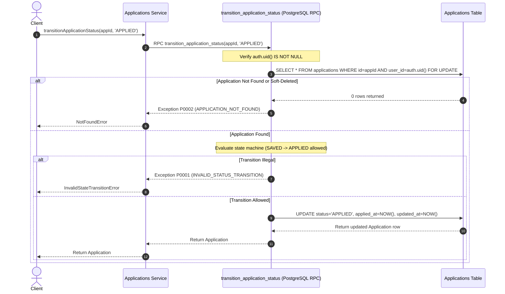
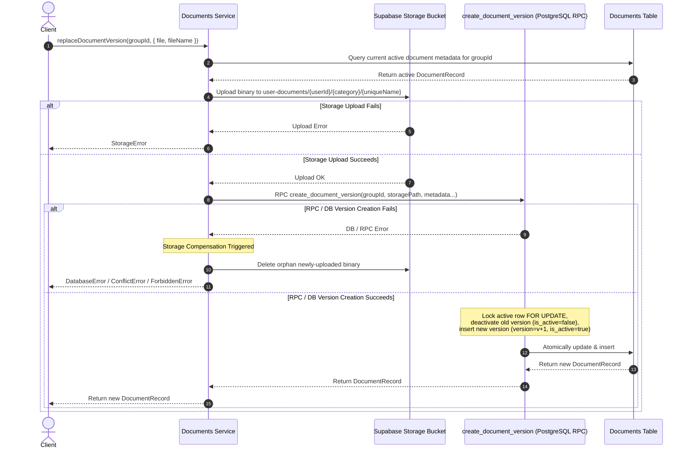
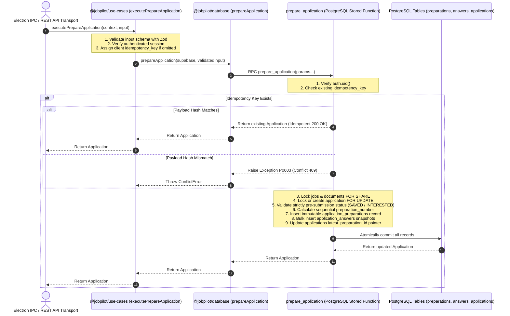

# JobPilot System & Runtime Flows

This document details the critical execution flows, lifecycles, and security boundaries across **JobPilot**.

---

## 1. Authentication & Session Initialization Flow

---

## 2. User Registration & Database Trigger Flow

---

## 3. Profile Data Access & Update Flow

---

## 4. Electron IPC Bridge Security Architecture

---

## 5. Document Storage Upload Flow

---

## 6. Applications State Machine & Document Replacement Flow

### Atomic Application Status Transition

### Document Replacement & Storage Compensation

---

## 7. Repeatable Application Preparation & Use Cases Layer Flow

> **Pre-Submission Invariant**: Application preparation is strictly allowed only while status is `SAVED` or `INTERESTED`. Attempting preparation on `APPLIED`, `ASSESSMENT`, `INTERVIEW`, `OFFER`, `REJECTED`, `WITHDRAWN`, or archived applications is immediately rejected (`APPLICATION_STATUS_NOT_PREPARABLE` / `APPLICATION_IS_ARCHIVED`). No `PREPARED`, `READY`, or `DRAFT` status exists.
