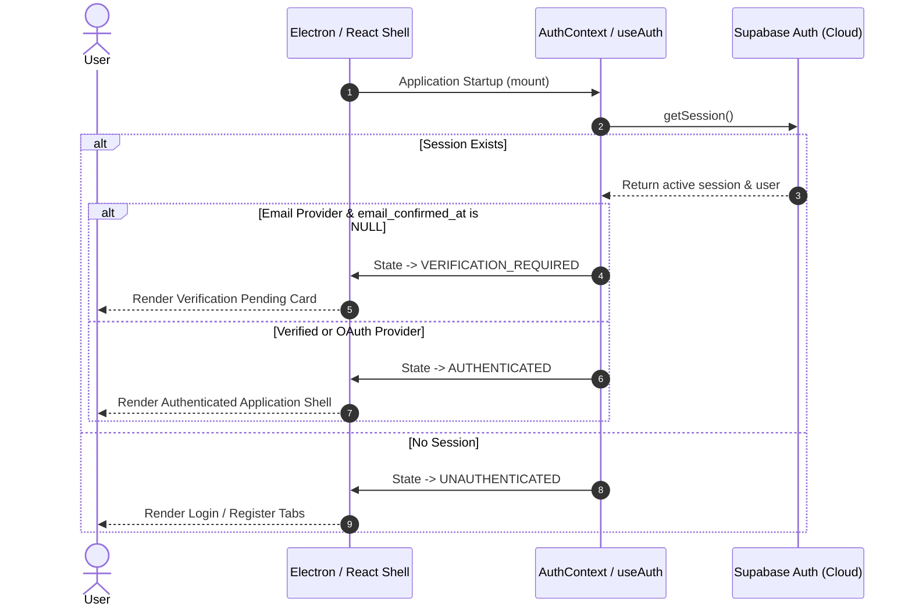
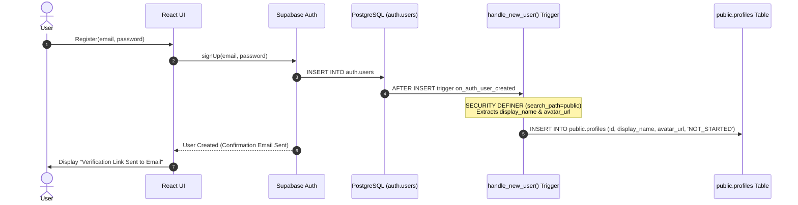
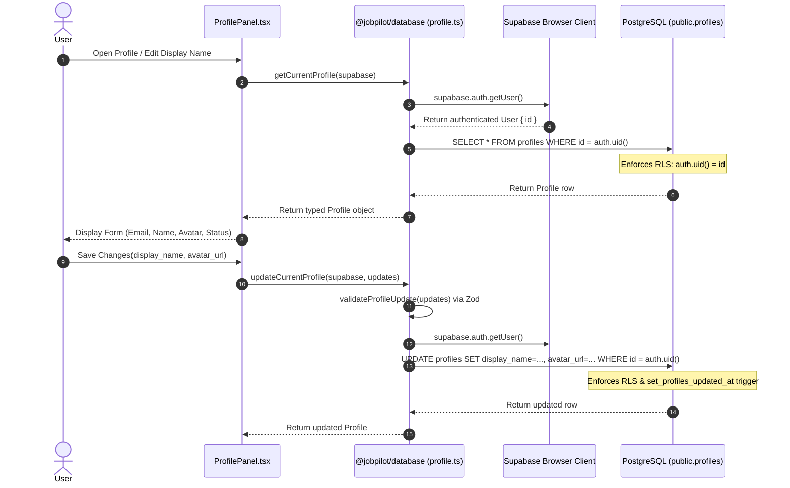
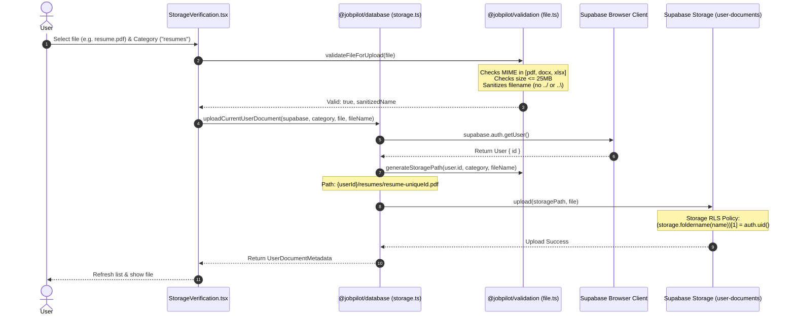

# JobPilot System & Runtime Flows

This document details the critical execution flows, lifecycles, and security boundaries across **JobPilot**.

---

## 1. Authentication & Session Initialization Flow



---

## 2. User Registration & Database Trigger Flow



---

## 3. Profile Data Access & Update Flow



---

## 4. User-Scoped Private Document Storage Flow



---

## 5. Cross-Tenant Storage Isolation Enforcement

```text
User A (UUID: 1111-1111)                User B (UUID: 2222-2222)
      │                                       │
      ▼                                       ▼
user-documents/                         user-documents/
  1111-1111/resumes/resume.pdf            2222-2222/resumes/cv.docx
      │                                       │
      ├───────────────────┬───────────────────┤
      │                   │                   │
      ▼                   ▼                   ▼
[User A Session]    [User B Session]    [Unauthenticated]
   SELECT A: ALLOW     SELECT A: DENY      SELECT A: DENY
   SELECT B: DENY      SELECT B: ALLOW     SELECT B: DENY
   DELETE A: ALLOW     DELETE A: DENY      DELETE A: DENY
```
